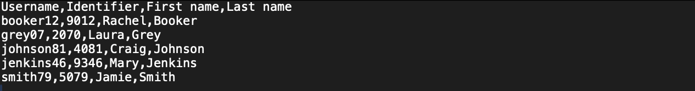
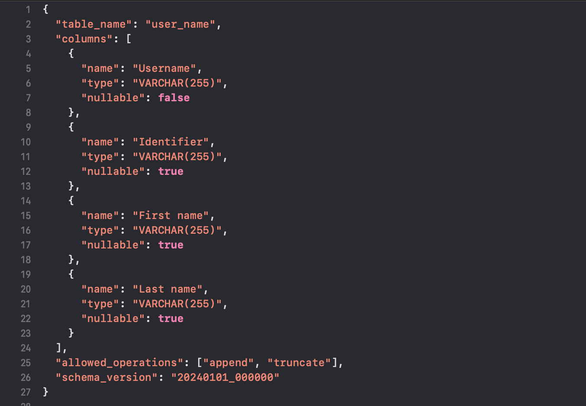

## ETL Pipeline

This project is an automated data pipeline I built using AWS. It is meant to automatically process data uploaded to an S3 data lake, and perform appropriate actions to load into a Redshift data warehouse for future analytics. The metadata is logged into DynamoDB to track the flow of data in the pipeline. I created an API using API Gateway to allow simple querying of the logging table.

## Overview 

Main components:

1. Data Pipeline and Data Lake
  * An S3 bucket serves as the central data lake.
    * Using prefixes, the S3 bucket allows users easily to append/truncate data or define/update schema.
    * The structure of the bucket is as follows: db_name/action/table_name/data.csv (action = append/truncate/schema).
    * Data is expected to be .csv format and schema files .json format.
  * When a file is uploaded to the bucket, an EventBridge event is triggered. This event initiates a step function.
  * The first lambda in this step function determines the action based on the file prefix. It then constructs an appropriate SQL query based on this to either         load data, update schema, or define new table/schema. I made use of the psycopg2 library to connect to my Redshift cluster and run queries.
  * The second lambda of the step function logs the metadata into a DynamoDB table to keep track of the flow through the ETL pipeline.
  
2. Pipeline Monitoring API
  * Provides a REST API endpoint via Amazon API Gateway for querying DynamoDB processing logs.
  * API calls take in table_name as a parameter, landed_timestamp as an optional additional parameter.

# Architecture

* S3: Serves as a data lake.
* EventBridge: Triggers state machine to execute step function.
* Step Function: Orchestrates execution of Lambda functions.
* Lambda: Processes file uploads into S3, takes appropriate action in Redshift and logs processing information into DynamoDB.
* Redshift: Serves as data warehouse, allows for efficient data analytics usage.
* DynamoDB: Logs metadata and keeps track of data flowing through pipeline.
* API Gateway: Provies an API for querying the DynamoDB table

# Diagram of Architecture

# Example Usage

Appending Data

* Consider we have a table in Redshift called user_data, in the dev database with the following schema/entries

   

* If we want to append to the table to include a new set of users, with this pipeline it is very simple. All you have to do is take a new .csv file with the same schema as the current table, upload it to the follwoing path in the S3 bucket db_name/append/table_name/data.csv. The pipeline will automatically process the data and will be loaded into the Redshfit table and the metadata will be logged in DynamoDB.

Truncating Data

* Consider the same table from the example above, this time instead of adding new users we want to replace the current users with a new set. Again, this is very easy to do with this pipeline. Simply upload a new .csv file to the S3 bucket, with the same schema as the existing table, at db_name/truncate/table_name/data.csv. The pipeline will automatically truncate the existing table and you will be left with only the new data uploaded.

Defining/Updating Schema

* This pipeline also supports updating existing table schema or creating new tables by defining a schema. Below is an example .json schema file to define a user data table

* In this example we are creating a table with Username, Identifier, First name and Last name columns. We also defined allowed_operations to only permit truncate and append operations. If we want to also allow schema updates then we could include that in the allowed_actions field.

# Summary

I recently completed both the AWS Certified Solutions Architect Associate and the AWS Certified Data Engineer Associate exams. I built this project to get hands on experience with AWS and apply what I have learned through the certification process. 

  
